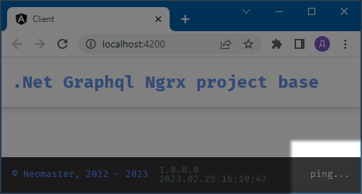

# NGN
**.Net Graphql Ngrx project base**

[](https://dotnet.microsoft.com/en-us/download/dotnet/6.0)
[](https://chillicream.com/docs/hotchocolate/v13)
[](https://www.npmjs.com/package/@angular/cli/v/15.0.5)
[](https://www.npmjs.com/package/graphql/v/16.6.0)
[](https://www.npmjs.com/package/graphql-ws/v/5.11.3)
[](https://www.npmjs.com/package/apollo-angular/v/4.2.1-alpha-20230210085539-0e747997)

---
1. [About](#1)
2. [GraphQL Examples](#2)
3. [EF Migration](#3)

## <a name="1"></a> 1. About
This project is the basis for Web API projects, which has two features:
1. GraphQL is used as a transport layer between the infrastructure and the client application.
2. The client application is permanently connected to the server via a web socket.
This is done so that the client application always knows the state of the server.
A detailed development history is included in [Mr.Apelsin](https://github.com/neomasterhub/MrApelsin).

### Server Connection NgRx Action Diagram
* The dots represent events.
* The store contains two states:
the state of the server and the last message received via the web socket.


### Server Status Indicator



### Redux Log


## <a name="2"></a> 2. GraphQL Examples

### Mutation
```graphql
mutation AddAuditEvent($e: AddAuditEventInput) {
  addAuditEvent(e: $e) {
    id
    dateTimeUtc
    url
    subject
    description
  }
}
```
**Variables**
```json
{
  "e": {
    "description": "test",
    "subject": "John Doe"
  }
}
```

### Query
```graphql
query AuditEvents($skip: Int!, $take: Int!) {
  auditEvents(order: { id: DESC }, skip: $skip, take: $take) {
    items {
      id
      dateTimeUtc
      url
      subject
      description
    }
    totalCount
  }
}
```
**Variables**
```json
{
  "skip": 1,
  "take": 2
}
```

### Subscription
```graphql
subscription ServerMessageReceived {
  serverMessageReceived {
    messageType
    contentType
    content
  }
}
```
**Ping**
```graphql
mutation {
  ping {
    messageType
    contentType
    content  
  }
}
```

## <a name="3"></a> 3. EF Migration
```cmd
cd webapi
dotnet ef database update --configuration=Release
```
The Release configuration is used because so that there are no links to unit test classes.
