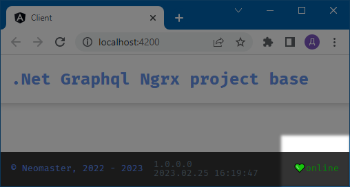

# NGN
**.Net Graphql Ngrx project base**

1. [About](#1)
2. [GraphQL Examples](#2)
3. [EF Migration](#3)

##  1. About
This project is the basis for Web API projects, which has two features:
1. GraphQL is used as a transport layer between the infrastructure and the client application.
2. The client application is permanently connected to the server via a web socket.
This is done so that the client application always knows the state of the server.

### Server Connection NgRx Action Diagram
* The dots represent events.
* The store contains two states:
the state of the server and the last message received via the web socket.

### Server Status Indicator

### Redux Log

